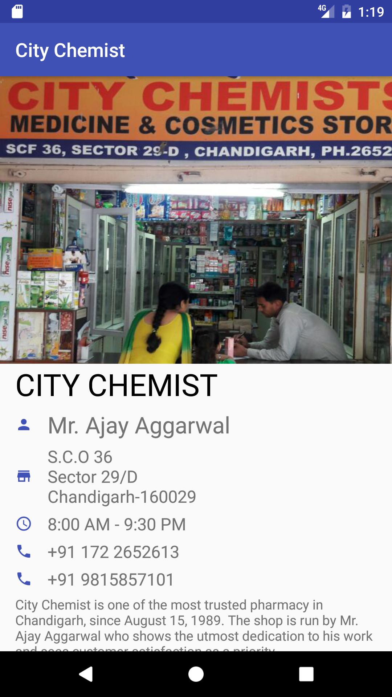

# My First App

This is the first project in the Nanodegree which is made completely in XML. The App is a single screen, static application.

The Application is a simple app that displays information about a small business.

### Things Learnt

To develop the application, we learnt about the basic android View elements such as:
* Layouts
  * Relative Layout
  * Linear Layout
  * Nested Layouts
* Nested ViewGroups
* ImageViews
* TextViews
* Units in Android

### Rubric
The Design includes:

* Business Name
* At least one photo representing the business
* Two or more other pieces of information, such as:
  * Contact information for business, eg, Phone number, website, email etc.
  * Address of the business
  * Description of business
  * Hours of Operation

### Screenshot

